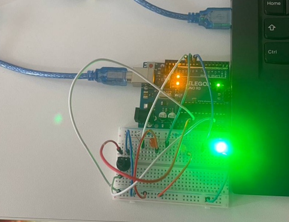

# LEDMeter

A simple Arduino project that uses a potentiometer to control 3 LEDs based on analog voltage levels.

## Description

This project reads the voltage from a potentiometer connected to analog pin A2 on the Arduino.  
Based on the voltage range, it lights up:

- **Green LED** for voltage < 3.0V  
- **Yellow LED** for voltage between 3.0V and 4.0V  
- **Red LED** for voltage > 4.0V  

## Circuit

- **Analog Input:** Potentiometer middle pin to A2  
- **LED Outputs:**  
  - Green → pin 9  
  - Yellow → pin 10  
  - Red → pin 11  
- Resistors in series with LEDs to ground

## Files

- `LEDMeterProject.ino` — The Arduino sketch  
- `circuit.PNG` — A photo of the physical circuit  

## Usage

1. Upload the `.ino` file to your Arduino Uno  
2. Twist the potentiometer like to know the desired voltage  
3. Watch the LED light show the voltage range you are in

## Author

William Acquah.
